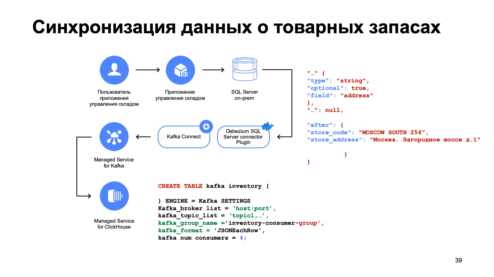
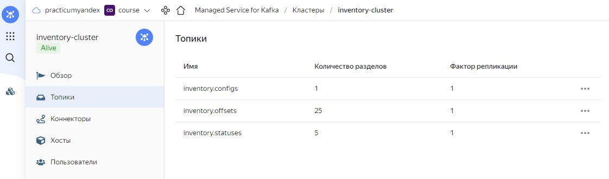
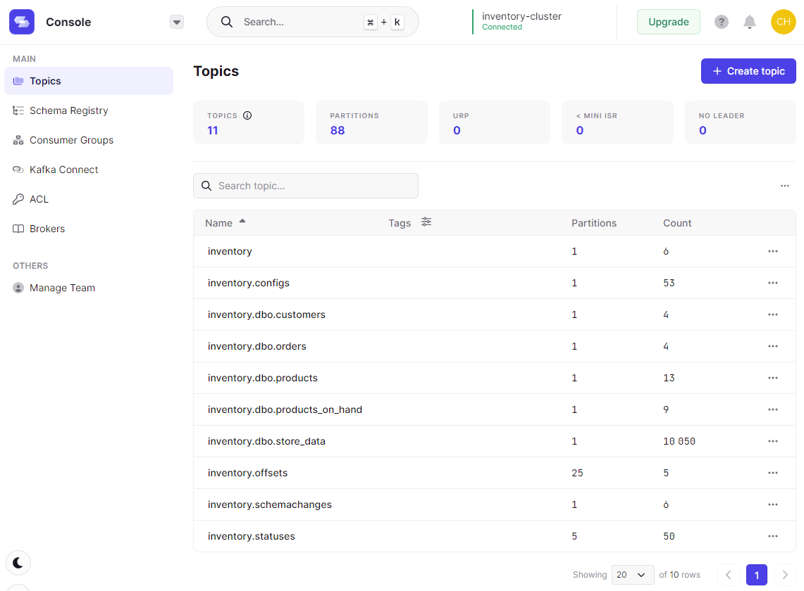

# Синхронизация данных из MS SQL Server



## Создаем кластер Kafka
1. В веб-консоли заходим в сервис Managed Service for Kafka и создаем кластер `inventory-cluster` версии 2.8.
2. Выбираем Управление топиками через API.
3. Включаем Публичный доступ.

Добавляем пользователя кластера Managed Service for Kafka с правами администратора через CLI:
```bash
yc managed-kafka user create inventory \
  --cluster-name inventory-cluster \
  --folder-id b1g7uigodj2tqaohibio \
  --password=pass@word1 \
  --permission topic="*",role=ACCESS_ROLE_ADMIN 
```

Устанавливаем флаг `auto-create-topics-enable`
```bash
yc managed-kafka cluster update --id c9qag7qig0hq1jldle60 --auto-create-topics-enable 
```

## Запускаем контейнер с Debezium и контейнер с MS SQL Server

> Фактически, наш контейнер с Debezium - это стандартный контейнер Debezium, 
> в котором дополнительно установлен корневой сертификат Yandex Cloud 
> и создано хранилище ключей client.truststore.jks с паролем pass@word1.

Заходим по SSH на виртуальную машину `magento`
```bash
sudo apt install git 
sudo apt install docker.io 
sudo gpasswd -a $USER docker
newgrp docker

git clone https://github.com/MaxKhlupnov/yc-cdc-datamart.git
cd ~/yc-cdc-datamart/debezium-cdc
docker build -t yc-connect -f ./yc-connect/Dockerfile yc-connect/. 
```

Прописываем в файле `~/yc-cdc-datamart/docker-compose.yaml` в параметре 
BOOTSTRAP_SERVERS адрес хоста кластера Kafka - `rc1a-rt35ilk2vrvspq82.mdb.yandexcloud.net:9091`.

Разворачиваем два контейнера - с Debezium и с MS SQL Server.
```bash
sudo apt install docker-compose

cd ~/yc-cdc-datamart
docker-compose up -d
```

В веб-интерфейсе проверяем наличие топиков offset, config и status:


Как видим - топики присутствуют, но только служебные.

Настраиваем подключение к MS SQL Server в Beaver:
- Адрес виртуальной машины с контейнером Debezium
- Тип аутентификации: SQL Server Authentication
- Имя пользователя: sa
- Пароль: Password!

Результат - не можем подключиться, проверяем запущенные контейнеры и оказывается, 
что для контейнера с MS SQL Server ресурсов не хватает.

Разворачиваем другую виртуальную машину `sqlserver` через веб-панель и повторяем все действия, которые были описаны выше.
А на машине `magento` останавливаем наши контейнеры.

Результат - успешное подключение к MS SQL Server в Beaver.

Затем создаем БД и заполняем начальными данными [inventory-mssql.sql](https://github.com/MaxKhlupnov/yc-cdc-datamart/blob/master/debezium-cdc/SQL/inventory-mssql.sql),
включаем SQL Server Agent для синхронизации [inventory-mssql.sql](https://github.com/MaxKhlupnov/yc-cdc-datamart/blob/master/debezium-cdc/SQL/starting-agent.sql).

Для работы с Kafka используем сервис [Conduktor](https://www.conduktor.io/), 
для подключения используем [client.truststore.jks](https://github.com/MaxKhlupnov/yc-cdc-datamart/blob/master/debezium-cdc/yc-connect/client.truststore.jks).

Запускаем синхронизацию, предварительно отредактировав шаблон запроса - 
`~/yc-cdc-datamart/debezium-cdc/SQL/register-connector.json`
```bash
cd ~/yc-cdc-datamart/debezium-cdc/SQL
curl -i -X POST \
    -H "Accept: application/json" \
    -H  "Content-Type: application/json" http://localhost:8083/connectors/ \
    -d @register-connector.json 
```

Убеждаемся, что топики создались и данные синхронизировались:
