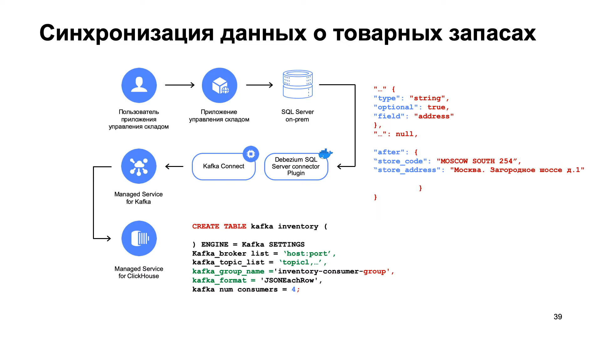

<<<<<<< .mine
# Синхронизация данных из MS SQL Server




=======
# Синхронизация данных из MS SQL Server


## Создаем кластер Kafka
1. В веб-консоли заходим в сервис Managed Service for Kafka и создаем кластер `inventory-cluster` версии 2.8.
2. Выбираем Управление топиками через API.
3. Включаем Публичный доступ.

Добавляем пользователя кластера Managed Service for Kafka с правами администратора через CLI:
```bash
yc managed-kafka user create inventory \
  --cluster-name inventory-cluster \
  --folder-id b1g7uigodj2tqaohibio \
  --password=pass@word1 \
  --permission topic="*",role=ACCESS_ROLE_ADMIN 
```

Устанавливаем флаг `auto-create-topics-enable`
```bash
yc managed-kafka cluster update --id c9qag7qig0hq1jldle60 --auto-create-topics-enable 
```

## Запускаем и донастраиваем контейнер с Debezium

> Фактически это стандартный контейнер, в котором дополнительно установлен корневой сертификат Yandex Cloud 
> и создано хранилище ключей client.truststore.jks с паролем pass@word1. 
> В него также добавлен корневой сертификат Yandex Cloud, 
> чтобы упростить задачу аутентификации в процессе выполнения работы.

Заходим по SSH на виртуальную машину `magento`
```bash
sudo apt install git 
sudo apt install docker.io 
sudo gpasswd -a $USER docker
newgrp docker

git clone https://github.com/MaxKhlupnov/yc-cdc-datamart.git
cd ~/yc-cdc-datamart/debezium-cdc
docker build -t yc-connect -f ./yc-connect/Dockerfile yc-connect/. 
```

Прописываем в файле `~/yc-cdc-datamart/docker-compose.yaml` в параметре 
BOOTSTRAP_SERVERS адрес хоста кластера Kafka - `rc1a-rt35ilk2vrvspq82.mdb.yandexcloud.net:9091`.

Разворачиваем два контейнера - с Debezium и с MS SQL Server.
```bash
sudo apt install docker-compose

cd ~/yc-cdc-datamart
docker-compose up -d
```

В веб-интерфейсе проверяем наличие топиков offset, config и status:

>>>>>>> .theirs
