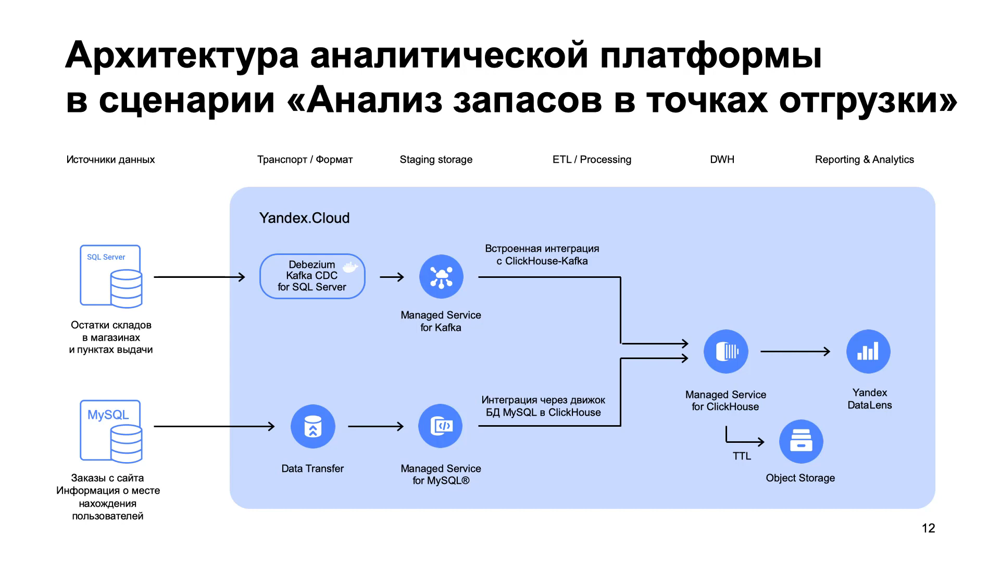
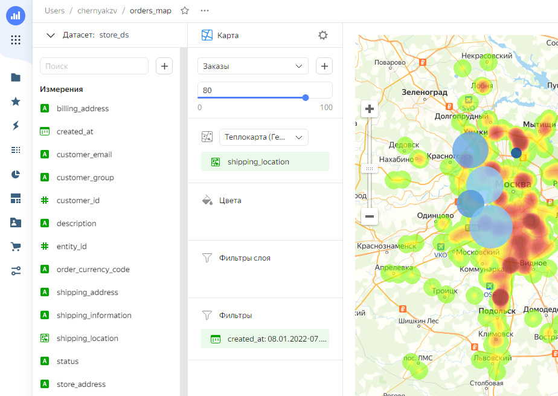
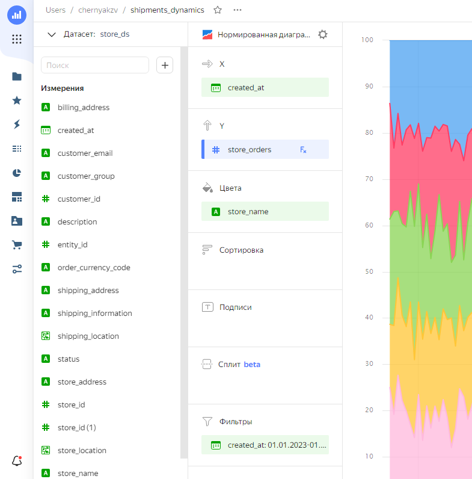
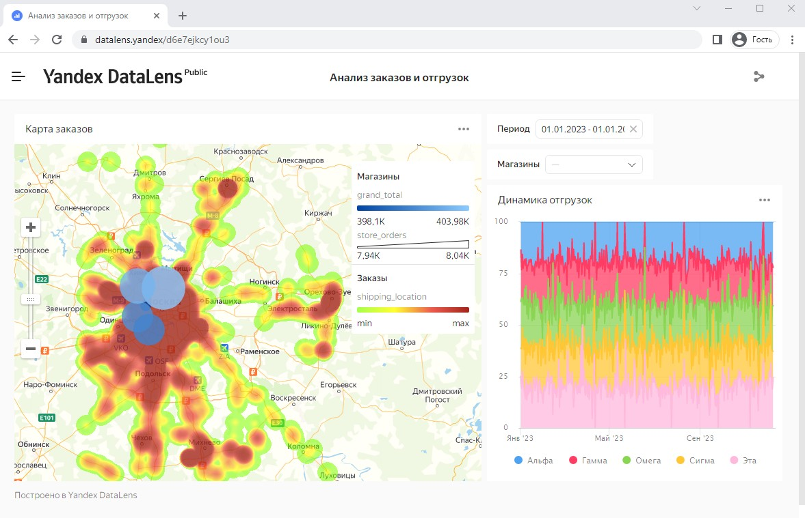

# Yandex Cloud: Построение корпоративной аналитической платформы
> https://cloud.yandex.ru/training/corpplatform  
> https://practicum.yandex.ru/profile/ycloud-corp/  
> Автор курса: Максим Хлупнов, архитектор Yandex Cloud

`Yandex Cloud` `MySQL` `MS SQL Server` `CDC` `Debezium` `Kafka` `ClickHouse` `Yandex Data Transfer` `Yandex DataLens`

### 1. Знакомство
Есть интернет-магазин выдуманной компании «Я-Пример».
Покупатели размещают в нем заказы, а отгрузка происходит из ближайшей выбранной точки.
Чтобы работа шла бесперебойно, товарные запасы должны поддерживаться на оптимальном уровне.

**Задача**: нужно создать дашборды с аналитическими отчетами, которые будут обновляться в реальном времени. 

**Особенности**: вся инфраструктура магазина развернута в «облаке». 
При этом информация о складских запасах и заказах хранятся в разных местах. 
Остатки за последний квартал - в хранилище данных на базе Microsoft SQL Server, а заказы - в базе данных MySQL.
Данные будут храниться в безопасном облачном хранилище, а за логику обработки и 
построение отчетов будут отвечать инструменты платформы. 

### 2. Обзор задачи и архитектуры

1. Передавать данные об изменениях будем при помощи процедуры CDC — Change Data Capture. 
   При этом обращаться к источникам данных будем не напрямую, а через промежуточные хранилища.
2. Ядром всей архитектуры станет ClickHouse.
3. Интернет-заказы хранятся в MySQL. Для синхронизации используем Yandex Data Transfer.
4. Данные об остатках хранятся в Microsoft SQL Server. Используем Debezium и Apache Kafka.

### 3. Загрузка в промежуточный слой
Мы не обращаемся напрямую к источникам данных, а используем промежуточные хранилища — это 
снижает задержку при передаче этих данных.  
При этом выгружаем только изменения через CDC, что минимизирует нагрузку на базы. 
Основные данные с заказами и остатками продолжают поступать в источники, работа сервиса не прерывается.

Для торговых остатков используем сервис Managed Kafka и Debezium CDC, 
а для заказов интернет-магазина — Managed MySQL коннектор из Yandex Data Transfer.

**Практика**  
1. [Синхронизация данных из MySQL](3.1_stg_mysql_sync.md)
2. [Синхронизация данных из MS SQL Server](3.2_stg_sqlserver_sync.md)

### 4. Гибридное хранение и обработка данных в ClickHouse
Через веб-панель создаем кластер Managed Service for ClickHouse с гибридным хранилищем (Object Storage) и 
настраиваем подключение к ClickHouse в DBeaver.

**Импорт данных из промежуточного хранилища MySQL в ClickHouse:**
- Создаем внешнюю таблицу, которая смотрит на соответствующую таблицу в промежуточном хранилище MySQL 
и делаем ее материализацию внутри ClickHouse с частичным хранением в Object Storage для данных старше месяца - 
[clickhouse.sql](sql/clickhouse.sql)
- Проверяем наличие данных в таблице ClickHouse - `inventory.sales_order`, данные успешно импортировались.

### 5. Загрузка данных из промежуточного слоя в аналитические витрины
**Импорт данных из промежуточного хранилища Microsoft SQL Server в ClickHouse:**
- Избавляемся от избыточной JSON-структуры данных в Kafka через Single Message Transformation
- Загружаем демо-данные в MS SQL Server - https://github.com/MaxKhlupnov/yc-cdc-datamart/blob/master/debezium-cdc/SQL/store_data_utf8.csv
- Создание внешней таблицы с использованием Engine Kafka не дало эффекта, данные не импортировались
- Используем запасной план - настраиваем Yandex Data Transfer с эндпоинтами Kafka и ClickHouse
- В ClickHouse появляется таблица `inventory.inventory_dbo_store_data_unparsed`, данные присутствуют в необработанном формате.
- Создаем представление в БД для таблицы выше [clickhouse.sql](sql/clickhouse.sql), где данные уже будут в удобном виде.

### 6. Построение сводных аналитических панелей в Yandex DataLens

- Создаем подключение в Yandex DataLens к ClickHouse
- Создаем датасет - источниками выбираем две таблицы `inventory.ch_store_data` и `inventory.sales_order`
- Корректируем типы данных в полях датасета (геоточка для полей с адресами)
- Настраиваем агрегаты:
  - объем продаж по каждой точке отгрузки;
  - количество уникальных заказов в точках;
  - количество клиентов, которые использовали торговую точку, чтобы забрать заказ.
- Создаем чарты:
  - тепловая карта с количеством заказов по настроенным геоточкам
  - график с динамикой отгрузок по каждой геоточке
- Формируем дашборд:
  - Добавляем на страницу оба чарта
  - Добавляем селекторы на период и магазин

**Настройки чарта с тепловой картой заказов и магазинов**  

**Настройки чарта с динамикой продаж в разрезе магазинов**  

**Итоговый дашборд**  

На дашборде видим, что большая часть покупателей находится на юге Москвы, 
при этом отгрузок больше из северной торговой точки — в ней больше товара. 
В связи с этим можно сделать вывод, что стоит перенести точку отгрузки с севера на юг: 
клиенты будут получать товар быстрее, а оборачиваемость товара в целом повысится.

[Дашборд в формате PDF](dashboard.pdf)

### 7. Заключение
Дашборт прошел успешное ревью, курс окончен.
