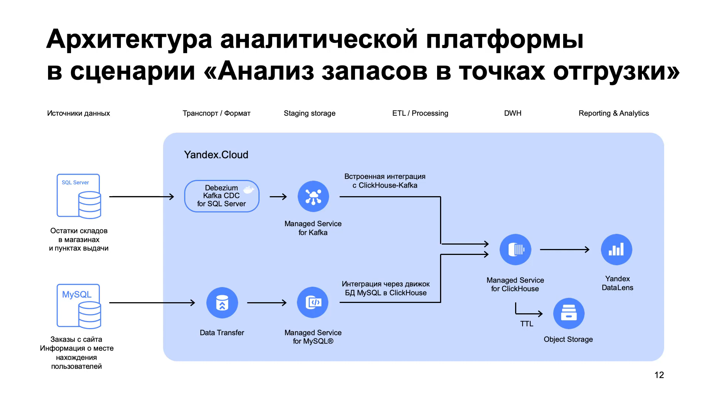

# Yandex Cloud: Построение корпоративной аналитической платформы
> https://cloud.yandex.ru/training/corpplatform
> Автор курса: Максим Хлупнов, архитектор Yandex Cloud

`Yandex Cloud` `MySQL` `MS SQL Server` `CDC` `Debezium` `Kafka` `ClickHouse` `Yandex Data Transfer`

### 1. Знакомство
Есть интернет-магазин выдуманной компании «Я-Пример».
Покупатели размещают в нем заказы, а отгрузка происходит из ближайшей выбранной точки.
Чтобы работа шла бесперебойно, товарные запасы должны поддерживаться на оптимальном уровне.

**Задача**: нужно создать дашборды с аналитическими отчетами, которые будут обновляться в реальном времени. 

**Особенности**: вся инфраструктура магазина развернута в «облаке». 
При этом информация о складских запасах и заказах хранятся в разных местах. 
Остатки за последний квартал - в хранилище данных на базе Microsoft SQL Server, а заказы - в базе данных MySQL.
Данные будут храниться в безопасном облачном хранилище, а за логику обработки и 
построение отчетов будут отвечать инструменты платформы. 

### 2. Обзор задачи и архитектуры

1. Передавать данные об изменениях будем при помощи процедуры CDC — Change Data Capture. 
   При этом обращаться к источникам данных будем не напрямую, а через промежуточные хранилища.
2. Ядром всей архитектуры станет ClickHouse.
3. Интернет-заказы хранятся в MySQL. Для синхронизации используем Yandex Data Transfer.
4. Данные об остатках хранятся в Microsoft SQL Server. Используем Debezium и Apache Kafka.

### 3. Загрузка в промежуточный слой
Мы не обращаемся напрямую к источникам данных, а используем промежуточные хранилища — это 
снижает задержку при передаче этих данных.  
При этом выгружаем только изменения через CDC, что минимизирует нагрузку на базы. 
Основные данные с заказами и остатками продолжают поступать в источники, работа сервиса не прерывается.

Для торговых остатков используем сервис Managed Kafka и Debezium CDC, 
а для заказов интернет-магазина — Managed MySQL коннектор из Yandex Data Transfer.

**Практика**  
1. [Синхронизация данных из MySQL](3.1_stg_mysql_sync.md)
2. [Синхронизация данных из MS SQL Server](3.2_stg_sqlserver_sync.md)

### 4. Гибридное хранение и обработка данных в ClickHouse
### 5. Загрузка данных из промежуточного слоя в аналитические витрины
### 6. Построение сводных аналитических панелей в Yandex DataLens
### 7. Заключение
